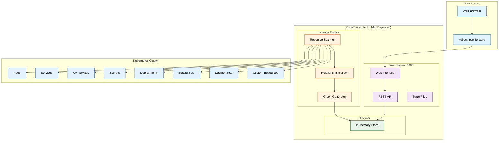
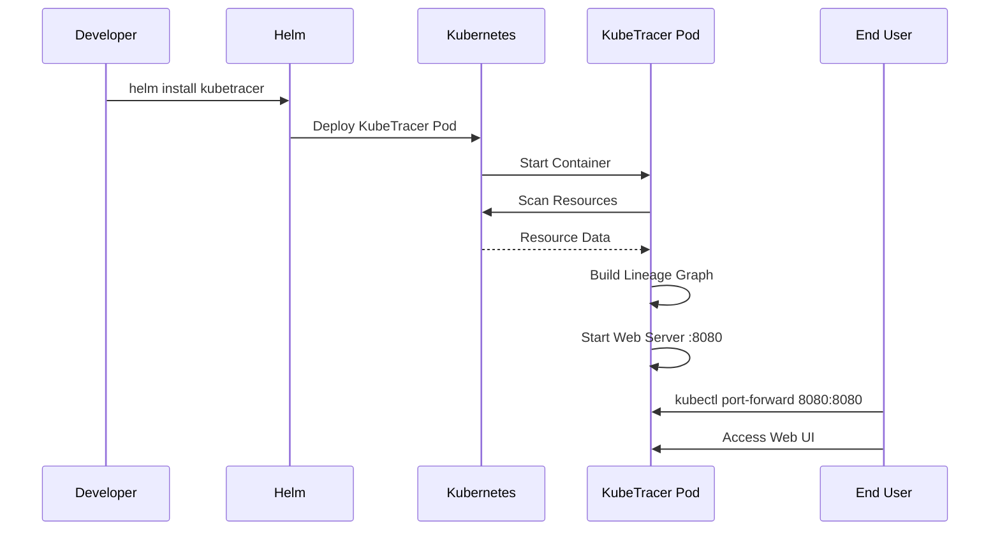

# KubeTracer - Simplified Architecture

## Deployment Architecture

## Key Benefits

- **🚀 Single Command Deployment**: `helm install kubetracer ./deployments/helm/kubetracer`
- **🔍 Auto Discovery**: Automatically scans all Kubernetes resources
- **📊 Simple Web UI**: Clean interface showing resource lineage
- **⚡ Fast Access**: In-memory storage for quick response times
- **🎯 Focused Scope**: Core lineage tracking without complexity
